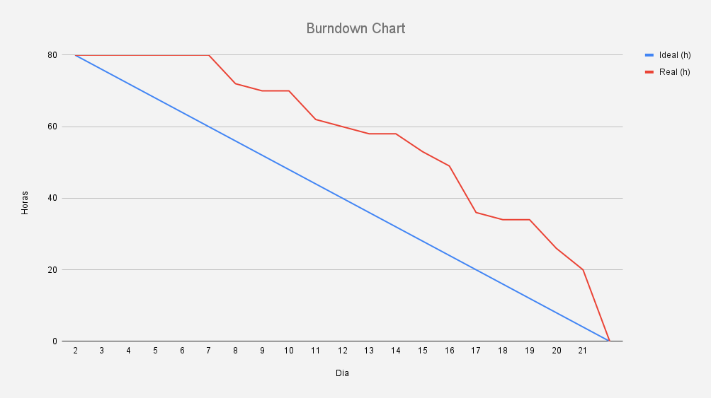
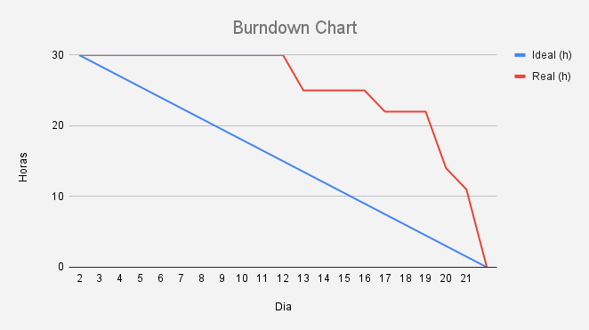

<h1 align="center">
Aplicação web e mobile para mapeamento automático de nuvens e sombras de nuvens em imagens
</h1>

<h2 align="center">
FATEC Prof Jessen Vidal, São José dos Campos - 5º Semestre DSM 2024
</h2>

    <a href="#sobre">Sobre</a> | 
    <a href="#tecnologias">Tecnologias</a> |
    <a href="#equipe">Equipe</a> | 
    <a href="#entregas">Entregas</a> | 
    <a href="#backlog">Backlog</a> |

<h1 align="center">Sobre</h1>

Esse projeto foi desenvolvido pelos alunos do 5º semestre da FATEC Prof Jessen Vidal, São José dos Campos em parceria com a empresa Visiona.

Ele tem como objetivo mapear automaticamente as nuvens e sombras de nuvens em imagens vindas do sensor WPM a bordo do satélite CBERS4A.

A ideia é da nossa aplicação é consultar estas imagens através do INPE e com o auxílio de um modelo de Inteligência Artificial, mapear as nuvens e suas sombras e disponibilizar a máscara dessas nuvens e suas sombras em duas plataformas diferentes: Desktop e Mobile.

<h1 align="center">Tecnologias</h1>

  
  
  
  
   
  
  
  

<h1 align="center">Equipe</h1>

  | Função | Foto | Nome | GitHub | LinkedIn |
  | :-: | :-: | :-: | :-: | :-: |
  | Product Owner |  | Bruno Denardo  | [GitHub](https://github.com/brunodenardo) | [LinkedIn](https://www.linkedin.com/in/bruno-denardo/) |
  | Backend Dev |  | José V. H. Lopes de Souza | [GitHub](https://github.com/HenningerJv) | [LinkedIn](https://www.linkedin.com/in/jose-victor-henninger-7661b928a/) |
  | Scrum Master |  | Matheus Fernando Vieira de Melo | [GitHub](https://github.com/Matheusfvm) | [LinkedIn](www.linkedin.com/in/matheusfvmelo) |
  | Frontend Dev |  | Murilo Henrique Sangi da Silva Lima | [GitHub](https://github.com/MuriloLima03) | [LinkedIn](https://www.linkedin.com/in/murilo-sangi-062780285/) |
  | Backend Dev |  | Pedro Henrique Silva Almeida | [GitHub](https://github.com/PedroHSdeAlmeida) | [LinkedIn](https://www.linkedin.com/in/pedroalmeidadev/) |
  | Frontend Dev |  | Vinicius de Oliveira Laranjeiro | [GitHub](https://github.com/vdlaranjeiro) | [LinkedIn](https://www.linkedin.com/in/vinicius-laranjeiro-296b371bb) |

<h1 align="center">Entregas</h1>
O projeto tem por base a metodologia ágil SCRUM, por isso foi separado em 4 entregas com sprints de 21 dias de duração cada uma.

 

 

<h2>Resultado das sprints:</h2>

<h2>Sprint 1</h2>

 

Essa sprint teve como foco gerar um modelo de IA inicial e funcional para identificar as nuvens e suas sombras, no servidor responsável por consumir a API do INPE e no cliente que envia os dados da pesquisa para servidor e consome as imagens sem e com o filtro de nuvens vindas do servidor.

<b>Sprint Backlog:<b>

| Sprint | Funcionalidade | Prioridade |
| :--:   | :-----------:  | :--------: |
| **01** | IA que produza máscaras de nuvem e de suas sombras | Alta |
| **01** | Consumir API do INPE do sensor WPM no satélite CBERS-4A | Alta |
| **01** | Interface desktop para pesquisa das imagens (Desktop)| Alta |

<b>Burndown:</b>

<b>Tarefas:</b>

O grupo optou pela organização das tarefas fazendo uso das User Story, tarefas e subtarefas.

Irei usar como exemplo a User Story relacionada com o serviço consumido pelo cliente, responsável por encaminhar as imagens pesquisadas na API do INPE para a IA e depois devolver as imagens e os filtros gerados pela IA para o cliente

| Tipo | Descrição |
| :--:   | :-----------:  |
| **User Story**| COMO usuário QUERO que o sistema crie máscaras de nuvem PARA me auxiliar na filtragem dessas imagens |
| **SubTarefa** | BACK - Consumir API do INPE usando intervalo de tempo e localização |
| **Subtarefa** | BACK - Criar uma API que recebe as requisições do Cliente |
| **Subtarefa** | BACK - Criar uma lógica que envie a imagem de satélite para o modelo de IA e recepcione o resultado |
| **Subtarefa** | BACK - Estudar o parâmetro bbox para entender melhor como funciona a seleção das imagens na API do INPE |

Houve também tarefas que não estavam relacionadas a nenhuma User Story. Um exemplo disso foram as tarefas de configuração de ambiente

| Tipo | Descrição |
| :--:   | :-----------:  |
| **Tarefa** | BACK - Configurar e criar base para repositório backend |
| **Tarefa** | FRONT - Configurar e criar base para repositório web |

Todas as tarefas podem ser consultadas clicando <a href = "https://docs.google.com/spreadsheets/d/1HTreSoiyFyLPOw225WGFWwoKD_gF4uPkpzrNhLRMcTw/edit?usp=sharing">aqui</a>

<h2>Sprint 2</h2>

 

Nesta sprint tivemos como foco a mudança do tipo de imagem no treinamento do modelo, de thumbnail para tiff, na lógica de usuário e seu histórico de consulta e também no download da imagem.

<b>Sprint Backlog:<b>

| Sprint | Funcionalidade | Prioridade |
| :--:   | :-----------:  | :--------: |
| **02** | Melhorias na IAe uso de TIFFs | Alta |
| **02** | Download de filtros | Alta |
| **02** | Histórico de requisições do Usuário | Média |

<b>Burndown:</b>

<b>Tarefas:</b>

O grupo optou pela organização das tarefas fazendo uso das User Story, tarefas e subtarefas.

Irei usar como exemplo a User Story relacionada com os downloads das imagens dos filtros

| Tipo | Descrição |
| :--:   | :-----------:  |
| **User Story**| COMO usuário QUERO poder aplicar filtros e baixar as imagens e mascaras de nuvem no desktop PARA utiliza-las em minhas análises e pesquisas |
| **SubTarefa** | IA - Converter os filtros de saída do modelo de IA em vetor |
| **Subtarefa** | FRONT - Criar lógica que aplique e desaplique o filtro nas imagens no frontEnd |
| **Subtarefa** | BACK - Incluir o link para o download do tiff e outras propriedades adicionais na resposta para o front |
| **Subtarefa** | FRONT - Criar lógica e botão de download |

Houve também tarefas que não estavam relacionadas a nenhuma User Story. Um exemplo disso foram as tarefas 

| Tipo | Descrição |
| :--:   | :-----------:  |
| **Tarefa** | IA - Montar um dataset a partir da api de tiff fusionado |
| **Tarefa** | IA - Passar a usar tiff na previsão |
| **Tarefa** | FRONT - Criar um modal para visualizar as imagens em um tamanho maior |

Todas as tarefas podem ser consultadas clicando <a href = "https://docs.google.com/spreadsheets/d/1J3sLY49wz2yoR_3MJh6oMyfSYQd4llnLgy5uJMeMzGY/edit?usp=sharing">aqui</a>

<h2>Sprint 3</h2>

 

Nesta sprint tivemos como foco a entrega do aplicativo, implementação do GeoJson, lógica de filas para gerenciar as requisições e melhorias na IA.

<b>Sprint Backlog:<b>

| Sprint | Funcionalidade | Prioridade |
| :--:   | :-----------:  | :--------: |
| **03** | Plataforma mobile para aplicação | Alta |
| **03** | Download de filtros de nuvens e de suas sombras (Mobile) | Alta |
| **03** | Fila para geenciar as requisições | Média |
| **03** | Melhorias na IA | Média |

<b>Burndown:</b>

<b>Tarefas:</b>

O grupo optou pela organização das tarefas fazendo uso das User Story, tarefas e subtarefas.

Irei usar como exemplo a User Story relacionada ao mapa de consulta para a requisição da imagem no celular

| Tipo | Descrição |
| :--:   | :-----------:  |
| **User Story**| COMO usuário QUERO ser capaz de visualizar e procurar as imagens em uma interface mobile PARA usar o serviço em meu celular |
| **SubTarefa** | MOBILE - Gerar coordenada bbox e criar formulário de requisição da api do backend |
| **Subtarefa** | MOBILE - Pegar as imagens que está no json enviado pelo backend e plota-las na tela |

Houve também tarefas que não estavam relacionadas a nenhuma User Story. Um exemplo disso foram as tarefas 

| Tipo | Descrição |
| :--:   | :-----------:  |
| **Tarefa** | IA - Anotar 200 imagens para popular o datasert |
| **Tarefa** | IA - Treinar o modelo de IA para aprimorar as métricas do mesmo |

Todas as tarefas podem ser consultadas clicando <a href = "https://docs.google.com/spreadsheets/d/1SxBlZXxWbLReSYaCczvpgzOGUwEeVA47uaAmONXoWso/edit?usp=sharing">aqui</a>

<h2>Sprint 4</h2>

 

Nesta sprint o foco foi em entregar as estatísticas dos filtros, página home, deploy da aplicação e a documentação da API

<b>Sprint Backlog:<b>

| Sprint | Funcionalidade | Prioridade |
| :--:   | :-----------:  | :--------: |
| **03** | Estatísticas dos filtros de fundo, nuvem e sombra de nuvem | Alta |
| **03** | Deploy da aplicação | Alta |
| **03** | Documentação da API | Média |
| **03** | Página home (Mobile e Desktop) | Baixa |

<b>Tarefas:</b>

O grupo optou pela organização das tarefas fazendo uso das User Story, tarefas e subtarefas.

Irei usar como exemplo a User Story relacionada ao mapa de consulta para a requisição da imagem no celular

| Tipo | Descrição |
| :--:   | :-----------:  |
| **User Story**| COMO usuário QUERO que o sistema me informe a porcentagem de cobertura de nuvens e de sombras de nuvens PARA analises em cima das imagens |
| **SubTarefa** | BACK - Alterar a estrutura do objeto que o serviço de Back-End recebe do modelo de IA e envia para o serviço de Front-End |
| **Subtarefa** | IA - Estatística de cobertura de nuvens e de sombras de nuvem |
| **Subtarefa** | FRONT - Alterar o Modal de visualização das máscaras de nuvens e sombras de nuvens para mostrar os dados das estatísticas de cada filtro |

Houve também tarefas que não estavam relacionadas a nenhuma User Story. Um exemplo disso foram as tarefas 

| Tipo | Descrição |
| :--:   | :-----------:  |
| **Tarefa** | DEVOPS - Criar pipeline para automatizar o deploy das imagens no dockerhub |

Todas as tarefas podem ser consultadas clicando <a href = "https://docs.google.com/spreadsheets/d/1EPe8SwGRVxc59Sm4GmKKZvjjQesKHVK9y2t-fz7iBCk/edit?usp=sharing">aqui</a>

<h1 align="center">Backlog</h1>

| Sprint | Funcionalidade | User Story | Prioridade |
| :--:   | :-----------:  | :--------: | :--------: |
| **01** | IA que produza máscaras de nuvem e de suas sombras | US01 | Alta |
| **01** | Consumir API do INPE do sensor WPM no satélite CBERS-4A | US02 | Alta |
| **01** | Interface desktop para pesquisa das imagens (Desktop) | US03 | Alta |
| **02** | Melhorias na IA e uso de TIFFs | ---- | Média |
| **02** | Download dos filtros de nuvens e de suas sombras (Desktop) | US04 | Média |
| **02** | Histórico de requisição de cada usuário | US11 | Média |
| **03** | Interface mobile | US06 | Média |
| **03** | Download de filtros de nuvens e de suas sombras (Mobile) | US07 | Média |
| **04** | Página home (Desktop) | US05 | Baixa |
| **04** | Página home (Mobile) | US05 | Baixa |
| **04** | Estatísticas relacionadas à busca | US10 | Baixa |

<b>User Story</b>

| User Story | Descrição |
| :--: | :-----------:  |
| US01 | COMO usuário QUERO que o sistema crie máscaras de nuvem PARA me auxiliar na filtragem dessas imagens |
| US02 | COMO usuário QUERO que o sistema me forneça imagens do CBERS-4A/WPM PARA utiliza-las em minhas análises e pesquisas |
| US03 | COMO usuário QUERO ser capaz de visualizar, procurar as imagens em uma interface desktop PARA usar o serviço em meu Computador |
| US04 | COMO usuário QUERO poder aplicar filtros e baixar as imagens e mascaras de nuvem no desktop PARA utiliza-las em minhas análises e pesquisas |
| US05 | COMO usuário QUERO uma tela que me informe como usar e como funciona Solaris no desktop e mobile PARA utilizar o serviço de forma adequada no meu computador |
| US06 | COMO usuário QUERO ser capaz de visualizar e procurar as imagens em uma interface mobile PARA usar o serviço em meu celular |
| US07 | COMO usuário QUERO poder aplicar filtros e baixar as imagens e mascaras de nuvem no mobile PARA utiliza-las em minhas análises e pesquisas |
| US08 | COMO usuário QUERO um histórico das minhas consultas PARA ter um acesso fácil à informações que são relevantes para mim |
| US09 | COMO usuário QUERO que o sistema me informe a porcentagem de cobertura de nuvens e de sombras de nuvens PARA analises em cima das imagens |
| US10 | COMO usuário QUERO logar na minha conta PARA ter acesso as minhas consultas anteriores e as em aberto das imagens e dos filtros dessas imagens |